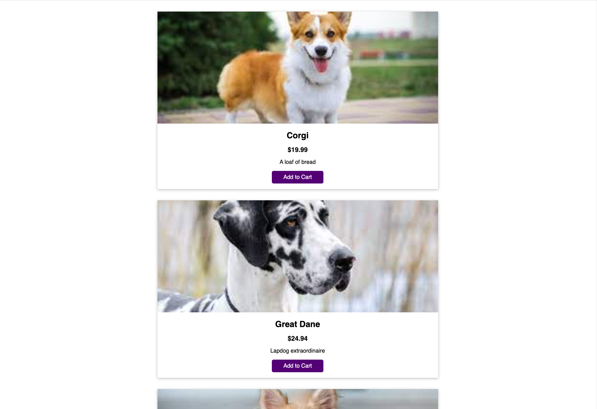
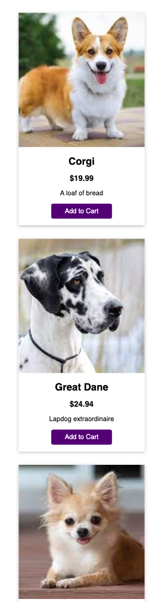

# Practice Classes & Object-Oriented Programming (OOP) 

An imaginary shop where you can purchase a dog.

Images are sources from Google images 

Tutorial is from "Modern JavaScript from the beginning - all the way up to JS expert level! THE must-have JavaScript resource in 2023." by Maximilian Schwarzmüller. 

## Skills Learnt 

* Defining and using First Class
* Working with Contructor Methods 
* Using & "Connecting" Multiple Classes
* Binding Class Methods & Working with "this"

---

## App Images

Desktop Size 

